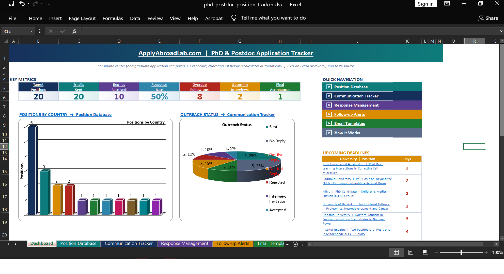

# PhD & Postdoc Position Tracker

**Application Tracker Pro** is a free Excel workbook for PhD and postdoc applicants who are contacting many professors and tracking many positions at the same time. It replaces the usual chaos of scattered notes with one file that tells you, every morning, exactly which follow-up to send and which deadline is next.

Built by [Ali Soltanhosseini](https://www.linkedin.com/in/ali-soltanhosseini-aut/) from twelve years of advising Iranian applicants to European universities through [Apply Abroad Lab](https://applyabroadlab.com).



## Download

Grab **`phd-postdoc-position-tracker.xlsx`** from the repository root, open it in Excel for Windows or Mac, and click *Enable Editing*. That is all; there are no macros and nothing to install.

> Google Sheets and LibreOffice open the file, but the 3D charts render flat there.

## What is inside

| Sheet | Purpose |
|---|---|
| **Dashboard** | Seven live KPI cards, four 3D charts, the eight most overdue follow-ups and the eight nearest deadlines. Every card, chart title and row is a hyperlink to its source cell. |
| **Position Database** | One row per target position: university, country, level, funding, deadline, priority, supervisor, posting link. *Days to Deadline* is calculated and color-coded. |
| **Communication Tracker** | One row per email campaign. Pick the position ID from a drop-down and the title, university and country fill in. *Days Since* and *Next Follow-up* are calculated and stop automatically when a case closes. |
| **Response Management** | Every reply you receive: date, status, summary, meeting date, outcome, next action. |
| **Follow-up Alerts** | The full list with a plain-language action for each row: urgent, prepare, monitoring, closed. |
| **Email Templates** | Five templates covering the whole cycle: first contact, first follow-up, final follow-up, reply to interest, thank-you after interview. |
| **How It Works** | Five-step guide and color legend. |

### How the dashboard links work

Click any KPI card and Excel jumps to the column that feeds it; that column's header is filled in the same color as the card and the column body carries a light tint, so the source is obvious. Rows in the *Needs Follow-up Now* and *Upcoming Deadlines* lists jump to the exact row in the tracker or database, where overdue rows are shaded red and near-deadline rows amber.

### Capacity and safety

- Up to 200 positions and 200 email campaigns; 116 reply records
- No locked cells, no macros, no external links
- 3,676 formulas, all standard Excel functions (INDEX/MATCH, COUNTIF, HYPERLINK)

## Sample data

The workbook ships with 20 real, currently open PhD and postdoc positions from the [Apply Abroad Lab position database](https://applyabroadlab.com/position/) (as of 27 September 2026). The outreach dates, statuses and replies attached to them are **illustrative only** so that the charts have something to show. Clear them before real use: delete rows 4 onward in *Communication Tracker* and *Response Management*, then replace the positions with your own.

## Rebuilding the workbook from code

The whole file is generated by one Python script, which is how the 3,676 formulas and the color-linked headers stay consistent.

```powershell
# in the repository root
pip install -r requirements.txt
python generator/build_tracker.py
```

`generator/sample_data.py` holds the 20 positions and the sample outreach state. Edit it, rerun the script, and you get a fresh workbook.

## License

MIT. Use it, share it, adapt it. A link back to [applyabroadlab.com](https://applyabroadlab.com) is appreciated.

## Author

Ali Soltanhosseini  
Apply Abroad Lab, [applyabroadlab.com](https://applyabroadlab.com)  
[databizex.com](https://databizex.com)  |  [LinkedIn](https://www.linkedin.com/in/ali-soltanhosseini-aut/)
